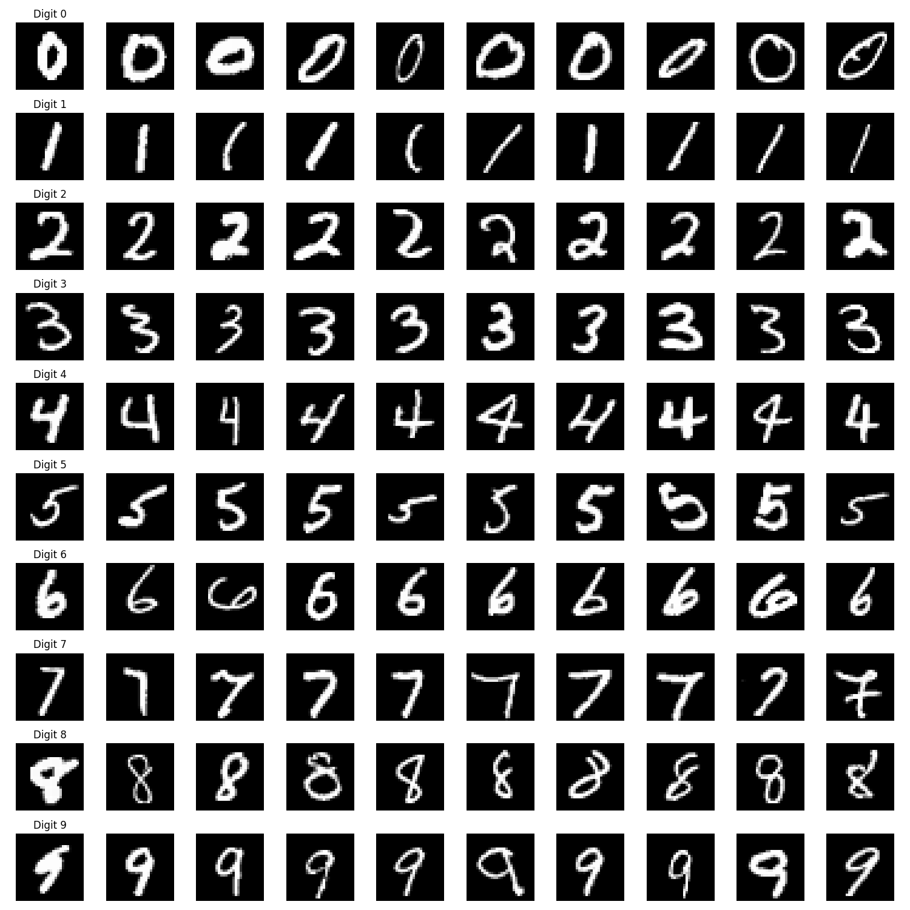
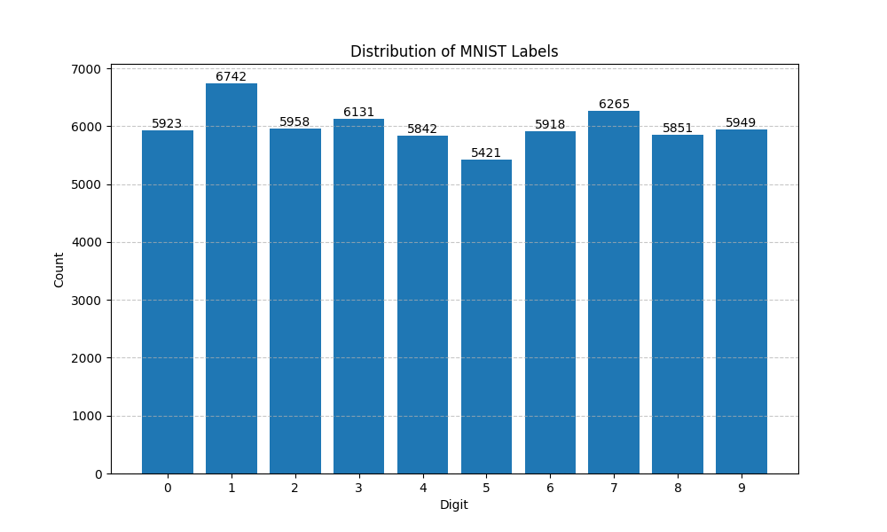

# MNIST Study Platform

## Project Overview

This project is an in-depth investigation of the MNIST dataset and Deep Neural Networks (DNNs). The primary goal is to explore and understand several key aspects of neural networks and their performance on handwritten digit recognition:

1. **Capabilities and Limitations**: What can current DNNs achieve on the MNIST dataset, and where do they fall short?
2. **Architectural Properties**: Which neural network properties are most relevant to performance in this specific case?
3. **Generalization and Real-World Applicability**: Is MNIST truly "solved"? What does this mean for real-world handwriting recognition? How well do these models generalize?

Through this investigation, we aim to gain deeper insights into the practical aspects of neural networks and their application to image recognition tasks.

## Getting Started

1. Clone the repository
2. Install dependencies: `pip install -r requirements.txt`

3. Inspect input data:
   ```bash
   # View dataset statistics and some examples (outputs @data_inspection/output)
   python data_inspection/scripts/data_inspection.py
   ```
   

4. Train models:
   ```bash
   # Train convolutional network
   python trainers/specific_trainers/conv_trainer.py
   
   # Train fully connected network 
   python trainers/specific_trainers/fc_trainer.py
   
   # View training progress in TensorBoard
   tensorboard --logdir=runs/
   ```

5. Analyze trained models:
   ```bash
   # Generate confusion matrices and performance metrics
   python model_interpretation/basic_interpret.py
   
   # live draw and predict intefrace:
   python model_interpretation/interactive_draw.py
   ```

## Project Structure

The project is organized into several key directories, each serving a specific purpose:

### `data/`
- Contains the MNIST dataset in its raw format
- Organized into training and testing sets
- Includes both images and labels

### `data_inspection/`
- Scripts for analyzing and visualizing the MNIST dataset
- Outputs include:
  - Sample digit visualizations
  - Label distribution analysis
  - Dataset statistics

### `models/`
- Contains two types of neural network implementations:
  - `parametric_models/`: Flexible architectures with configurable parameters
  - `specific_models/`: Fixed architectures
- Includes both fully connected and convolutional network implementations

### `model_interpretation/`
- Tools for analyzing model performance and behavior
- Includes:
  - Interactive drawing application for real-time testing
  - Basic interpretation scripts for model analysis
  - Confusion matrix visualizations

### `trainers/`
- Training infrastructure for different model types
- Includes:
  - Generic training utilities
  - Model-specific training scripts
  - Checkpoint management
  - TensorBoard logging

for each model specific model there is a specific trainer python file
### Model-Specific Trainers

- `conv_trainer.py`: Trainer for StandardConvNet
  - Uses BasicTrainer with optimized hyperparameters for convolutional architecture
  - Learning rate: 0.001
  - Batch size: 64
  - Number of epochs: 50
  - GPU preloading enabled

- `fc_trainer.py`: Trainer for StandardFCNet
  - Uses BasicTrainer with hyperparameters tuned for fully connected networks
  - Learning rate: 0.01
  - Batch size: 128
  - Number of epochs: 100
  - Implements learning rate scheduling


### `utils/`
- Common utilities and helper functions
- Data loading and preprocessing tools
- full dataset gpu-preloading option (very usefull for training runtimes).

## Study
### input inspection

Below is a sample of 10 handwritten digits from the MNIST dataset:



in terms of generalization expection with this dataset:  

pros:
- wide variety of digit styles within each digit label  

cons:
- very well centered 
- consistant sizes  

those properties will be investigated later on.  
  

the number of examples of each class:



the labels are evenly distributed. 

### model fitting
First, let's look at the training results for the fully connected model (StandardFCNet).

The model architecture consists of:
- Input layer: 784 nodes (28x28 flattened images)
- Hidden layer 1: 128 nodes with ReLU activation
- Hidden layer 2: 64 nodes with ReLU activation 
- Output layer: 10 nodes (one per digit)

[TODO: fill in training info]


## License

This project is licensed under the MIT License - see the LICENSE file for details. 