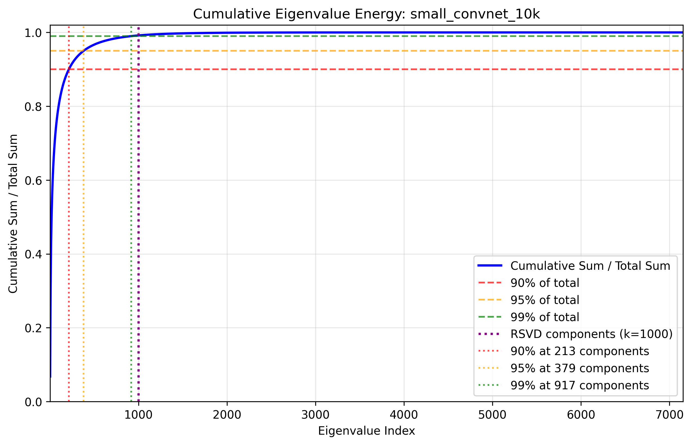
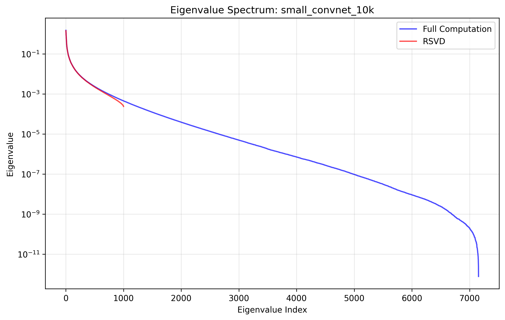

# Fisher information matrix computation in a neural network classifier


## Setup
Let's consider a neural network classifier with:
- Training samples $X = \{x_1, ..., x_n\}$ where $x_i \in \mathbb{R}^d$
- Labels $Y = \{y_1, ..., y_n\}$ where $y_i \in {1, 2, ... c}$

The data can be represented in matrix form as:
$$X \in \mathbb{R}^{n \times d}$$
$$Y \in \mathbb{R}^{n \times c}$$

where:
- n: number of training samples 
- d: input dimension
- c: number of classes 

The neural network defines a mapping $f_\theta: \mathbb{R}^d \rightarrow \mathbb{R}^c$ that produces class probabilities:
$$p(y|x,\theta) = f_\theta(x)$$  
where $\theta \in \mathbb{R}^m$ represents the learnable parameters of the neural network (weights and biases)  
where $ m $ is the number of parameters of the network.

we are interseted in estimating the fisher information matrix of such classifer.
The Fisher Information Matrix (FIM) is defined as:

```math
F(\theta) = \mathbb{E}_{x \sim p_{data}(x)} \mathbb{E}_{y \sim p(y|x,\theta)} \left[ \nabla_\theta \log p(y|x,\theta) \nabla_\theta \log p(y|x,\theta)^T \right]
```

where:
- $\theta$ represents the parameters of the neural network
- $p_{data}(x)$ is the data distribution
- $p(y|x,\theta)$ is the model's predicted probability distribution over classes
- $\nabla_\theta \log p(y|x,\theta)$ is the gradient of the log-likelihood with respect to parameters

This matrix captures the local geometry of the parameter space and measures how sensitive the model's predictions are to small changes in parameters.
our end goal is to emprically show that the eigenvalues of this matrix are decaying rapidally for 'good models' i.e models that generalizes well. 
the interpertation of such fisher information behaviour is a large volume in parameter space of modles which are close in the KL divergence sense to the true model (assuming we are computing the fisher information matrix with the correct distribution generating parameters).

### Finite Sample approximation
In practice, we approximate the Fisher Information Matrix using a finite sample of data points:

```math
F(\theta) \approx \frac{1}{N} \sum_{i=1}^N \sum_{c=1}^C p(y=c|x_i,\theta) \nabla_\theta \log p(y=c|x_i,\theta) \nabla_\theta \log p(y=c|x_i,\theta)^T
```

where:
- $N$ is the number of samples used for estimation
- $x_i$ are samples from the dataset (training / test split)
- $p(y|x_i,\theta)$ represents the neural network's predicted probability distribution over classes for input $x_i$


The Fisher Information Matrix size is $m^2$, which means for a model with just 1 million parameters (relatively small by today's standards), the matrix would be of size $10^{12}$ (1 trillion) elements.
thus, for pratcital computation, an approximation is required
## RSVD finite sample approximation
RSVD is a method from randomized linear algebra, which computes a low rank approximation of a matrix.
a well known in depth theory can be found here:
https://tropp.caltech.edu/papers/HMT11-Finding-Structure.pdf

**Prototype for Randomized SVD**

Given an $m \times n$ matrix $A$, a target number $k$ of singular vectors, and an exponent $q$ (say, $q = 1$ or $q = 2$), this procedure computes an approximate rank $k$ factorization $U\Sigma V^*$, where $U$ and $V$ are orthonormal, and $\Sigma$ is nonnegative and diagonal.

### Stage A:
1. Generate an $n \times k$ Gaussian test matrix $\Omega$.
2. Form $Y = (AA^* )^q A\Omega$ by multiplying alternately with $A$ and $A^* $.
3. Construct a matrix $Q$ whose columns form an orthonormal basis for the range of $Y$.

### Stage B:
4. Form $B = Q^* A$.
5. Compute an SVD of the small matrix: $B = \tilde{U}\Sigma V^*$.
6. Set $U = Q\tilde{U}$.

**Note:** The computation of $Y$ in step 2 is vulnerable to round-off errors. When high accuracy is required, we must incorporate an orthonormalization step between each application of $A$ and $A^*$; see Algorithm 4.4.

### Application to the finite sample fisher information matrix
For the finite sample Fisher matrix approximation, we can apply RSVD as follows:

1. Generate a random Gaussian matrix $\Omega \in \mathbb{R}^{m \times k}$ where $m$ is the number of parameters and $k$ is the target rank:
   $$\Omega \sim \mathcal{N}(0,1)^{m \times k}$$

2. Project the Fisher matrix onto $\Omega$. Using the finite sample approximation:  
   ```math
   Y = F\Omega = \frac{1}{N} \sum_{i=1}^N \sum_{c=1}^C p(y=c|x_i,\theta) \nabla_\theta \log p(y=c|x_i,\theta) \nabla_\theta \log p(y=c|x_i,\theta)^T\Omega
   ```
   Note that we never explicitly form the full Fisher matrix, instead we only have $m \times k$ projected matrix. 

   

3. Compute QR decomposition of $Y$:  
   
   $Y = QR$  
   
   where $Q \in \mathbb{R}^{m \times k}$ has orthonormal columns and $Q$ is a range approximation of $F$.

4. Project the Fisher matrix onto $Q$:  
   
   $B = Q^* F$
   
   using the finite sample form without explicitly constructing $F$:  
   
   $B = \frac{1}{N} \sum_{i=1}^N \sum_{c=1}^C p(y=c|x_i,\theta) Q^*\nabla_\theta \log p(y=c|x_i,\theta) \nabla_\theta \log p(y=c|x_i,\theta)^T$
   
   we are left with only an $m \times k$ matrix. 

5. Compute SVD of the small matrix $B$:
   
   $B = \hat{U}\Sigma\hat{V}^T$

6. Recover the left singular vectors:
   
   $U = Q\hat{U}$

7. Additional trick: eigenvalue tail power estimation for almost free:
   
   The sum of eigenvalues of the full FIM is just the trace of $F$, which can be computed very easily during one of the fisher information projection stages:  
   
   $S = \frac{1}{N} \sum_{i=1}^N \sum_{c=1}^C p(y=c|x_i,\theta) \nabla_\theta \log p(y=c|x_i,\theta)^T\nabla_\theta \log p(y=c|x_i,\theta)$

The resulting approximation is $F \approx U\Sigma U^T$ (since $F$ is symmetric, $V=U$)  
lets evaluate the performance of each step:

1. Draw a random Gaussian matrix $\Omega \in \mathbb{R}^{m \times k}$
   - Computation: $O(mk)$ - generating $mk$ random numbers
   - Memory: $O(mk)$ - storing the $mk$ matrix
   - Easily parallelizable: Yes, each entry can be generated independently
   
2. Project Fisher matrix onto $\Omega$ to get $Y = F\Omega$
   - Computation: $O(NC(O(\text{gradient}) + mk))$
   - Memory: $O(mk)$ - only store the projected matrix $Y$
   - Easily parallelizable: Yes, both over samples and over columns of $\Omega$  
   gradient computation can be both duplicated (recalculated on each GPU) or pre-computed this is a memory - compute tradeoff. 
   
3. QR decomposition of $Y$ to get $Q$
   - Computation: $O(2mk^2)$
   - Memory: $O(mk)$ to store $Q$
   - Parallelization: Limited, potential bottleneck. from my experince not significant computation-wise when fully stored on GPU, need to test what happens when its not the case (mxk larger than GPU RAM).
   
4. Project Fisher onto $Q$ to get $B$
   - Computation: $O(NC(O(\text{gradient}) + mk))$ (similar to step 2)
   - Memory: $O(mk)$ - only store the projected matrix $B$
   - Easily parallelizable: Yes, both over samples and over columns of $Q$ 
   
   
5. SVD of small matrix $B$
   - Computation: $O(4mk^2)$ for full SVD of $k \times k$ matrix
   - Memory: $O(k^2)$ for matrices
   - Parallelization: Limited, potential bottleneck. from my experince not significant computation-wise when fully stored on GPU, need to test what happens when its not the case (mxk larger than GPU RAM).

optional:

6. Final multiplication $U = Q\hat{U}$
   - Computation: $O(mk^2)$
   - Memory: $O(mk)$ for final $U$ matrix
   - Easily parallelizable: Yes, matrix multiplication can be parallelized


## Experiments
### MNIST dataset, Small Convnet ~ 7K parameters
the purpose of this experiment is the following:  
1. verify that full computation matches the RSVD approxmation.
2. get sense of the empirical runtime and memory requirements.

using a small convnet architecture with ~7k parameters we compute both the full fisher information matrix, and the rsvd approximation.  


The cumulative eigenvalue energy plot shows how much of the total spectral energy is captured by the first k components:




The following plot shows the eigenvalue comparison between the full computation and RSVD approximation:



